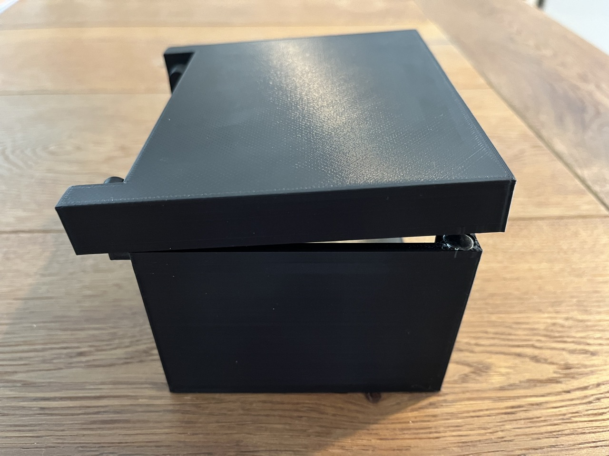
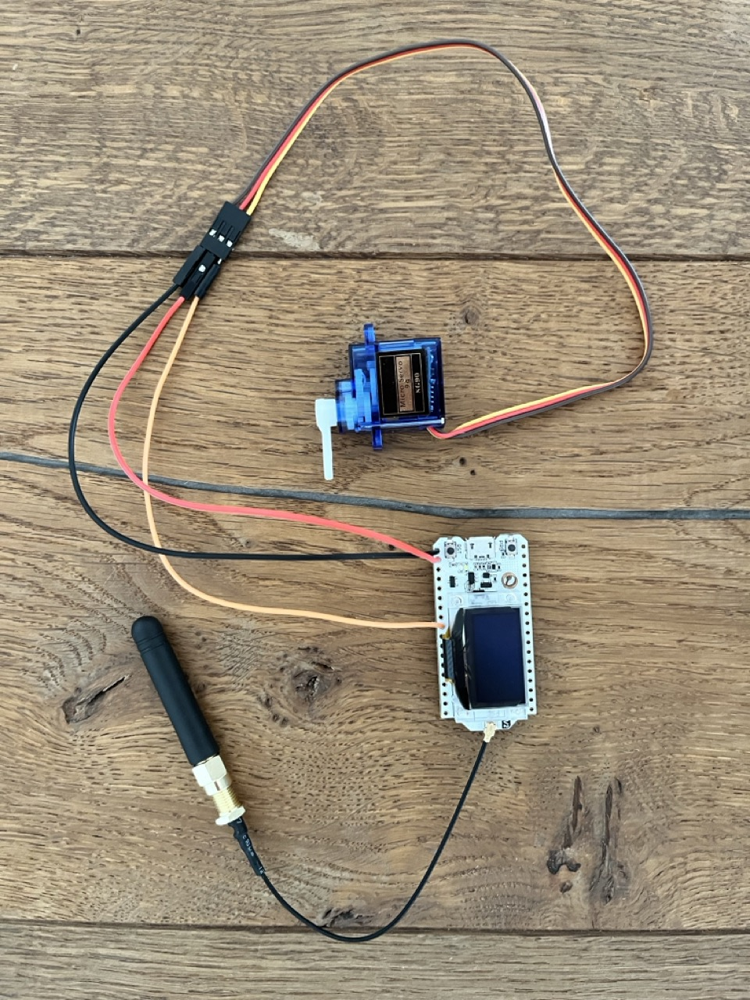
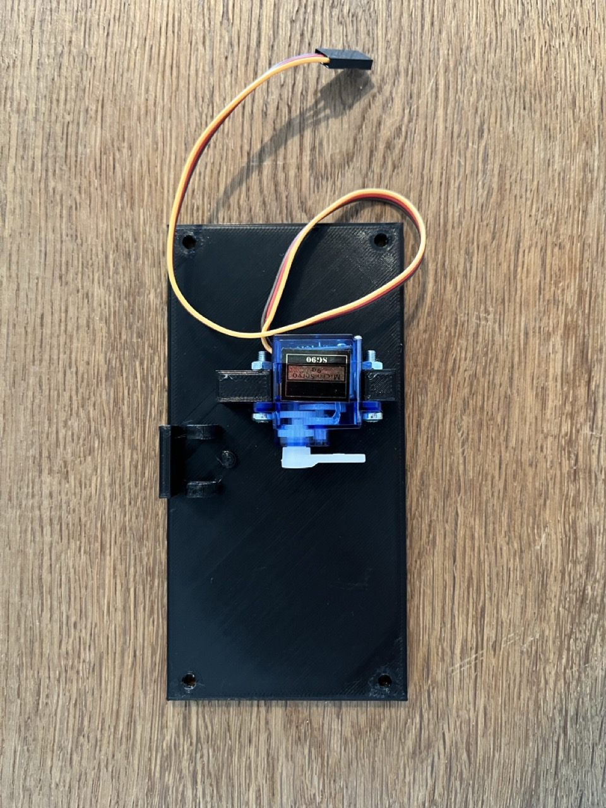
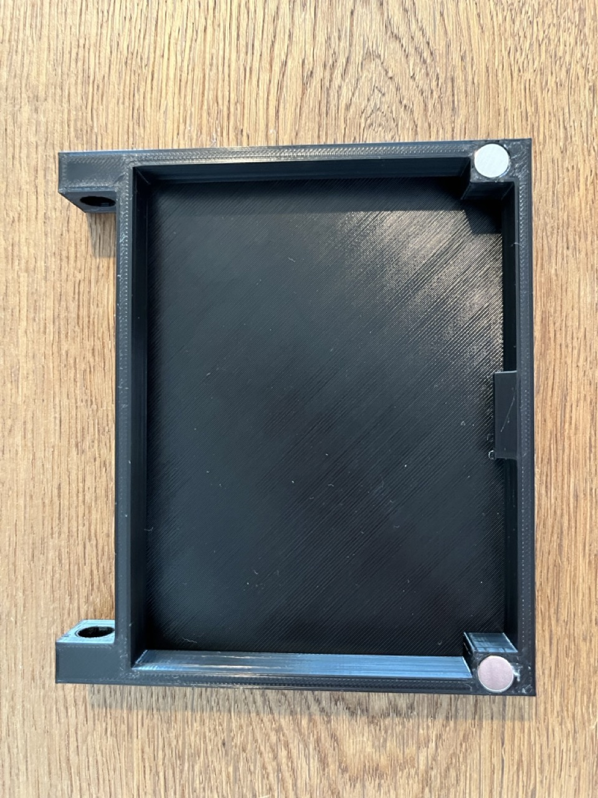
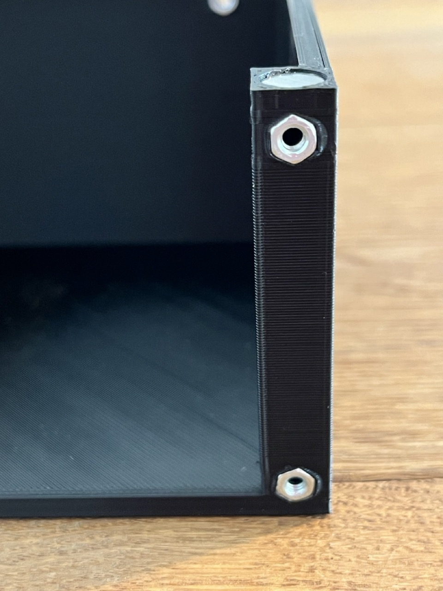
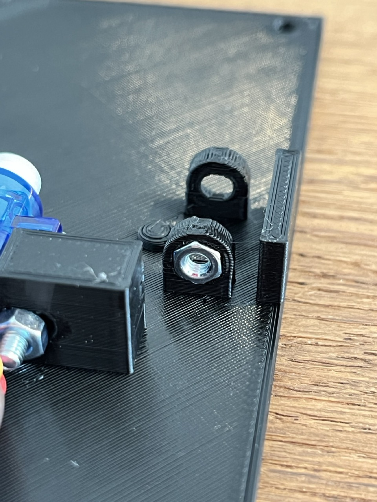
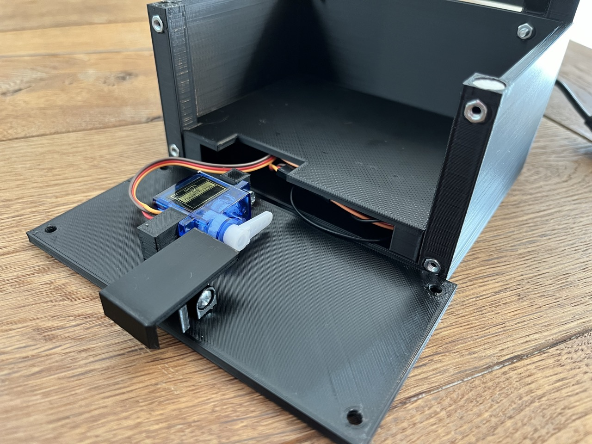

# Cipherlock
An IoT lockbox for hybrid scavenger hunts.

## Overview
Cipherlock is an IoT-based lockbox for hybrid scavenger hunts.

### The basic principle
Cipherlock consists of three main components: the _lockbox_, the _lockbox controller_, and the _game server_. In a future version, a fourth key component will the _LoRa gateway_.


The _lockbox_ is a 3D-printed treasure chest that cannot be manually opened from the outside.

Internally, the lockbox uses a spring-loaded latch to provide to hold the lid shut. The _lockbox controller_ controls a servo motor which retracts that lid, allowing the box to open. 


Magnets in the box's lid and base ensure that the lid opens automatically, once the latch is retracted.


The lockbox controller unlocks the box when it receives a command to do so from the game server. In its current implementation, the controller connects directly to the game server via a WebSocket. In a future version, this will be relayed through a LoRa connection between the lockbox controller and a LoRa gateway.

Outward, the game server provides REST API with several endpoints, one of which being `POST /checkAnswer`. A game spec file defines what type of answer is expected for a given lockbox (a.k.a. _cache_) and what answers are considered correct. When an acceptable answer is provided during a requet to the `/checkAnswer` endpoint, the corresponding lockbox receives an _unlock_ command, causing the lid to open automatically. A single game spec may define an arbitrary number of caches, each with their corresponding lockbox and answer definition.

### What's in this repository?
This repository contains the code for the following components of Cipherlock:
- `game-server`: The web API that contains the core game logic, such as receiving player answers and triggering lockboxes to unlock.  
- `lockbox`: The ESP32-based lockbox controller.
- `lora-gateway`: **Not yet implemented.**

### What's NOT in this repository?
- CAD files (not currently available to the public)
- Player and admin frontends (not part of this project; see [Implementing a user interface](#implementing-a-user-interface))
- Basic ESP32 development board setup (see [Flashing the Micropython firmware](#flashing-the-micropython-firmware))

## Usage
When setting up Cipherlock, it is recommended that you first complete the _external tasks_ outlined below, before proceeding with the deployment of Cipherlock itself.

### External tasks
#### Flashing the Micropython firmware
This project requires the [Micropython firmware](https://docs.micropython.org/en/latest/esp32/tutorial/index.html) to be installed on all ESP32 devices.

Clone [this repository](https://github.com/SilasBerger/nodemcu-setup) and follow the instructions outlined in the README to flash the appropriate Micropython firmware onto the ESP32 device. There, you can also find general information on how to interact with an ESP32 device through a serial connection (REPL and file transfer).

#### Implementing a user interface
Player and admin UI are not part of this project. They are developed individually and use the provided endpoints. For an example, see [here](https://github.com/SilasBerger/teaching-website/tree/feature/cipherlock-first-unlock).

#### 3D-printing and assembling the hardware
Print all the required parts and assemble the lockbox. For instructions, see [here](#hardware-assembly-instructions).

### Game server deployment
TODO (mention DEV-mode and loading a game file; game file format by example)

### Lockbox controller setup
Unless stated otherwise, all commands within this section need to be run from within the `lockbox` subdirectory.

#### First-time setup
If you haven't deployed to a lockbox controller from this machine (or this repository clone) before, first make sure to create and activate a _virtualenv_ and run `pip install -f requirements.txt` from within the **root of this repository**.

Then, from within the `lockbox` subdirectory, run

```shell
cp config.example.py config.py 
```

and edit the newly created `config.py` file to fit your specific configuration. **This file should never be checked into source control!**

Finally, run

```shell
chmod +x deploy.sh
```

to complete the first-time setup.

#### Deploying to the first lockbox controller
The following steps are ideally done immediately after a fresh firmware flash (see [flashing the Micropython firmware](#flashing-the-micropython-firmware)).

Connect the target ESP32 to your computer and run

```shell
./esptool.py chip_id | grep "Serial port"
```

to determine its serial port.

Then, run 

```shell
./deploy.sh <serial_port>
```

to deploy all files to the device.

#### Deploying to further lockbox controllers
To set up additional lockbox controllers, you will need to edit the `DEVICE_ID` value in `config.py` before each deployment. Each lockbox needs to have an individual numeric id between `1` and `255`.

Once the configuration has been updated for the next deployment, follow the same steps as when [Deploying to the first lockbox controller](#deploying-to-the-first-lockbox-controller).

#### Updating individual files
When updating individual files (such as `config.py`) on a previously deployed lockbox controller, run

```shell
./deploy <serial_port> <filename>
```

to copy only the specified file to the device.

### LoRa gateway setup
The LoRa gateway is not yet implemented. Currently, the lockbox controller connects directly to the game server via WiFi.

## Game server API
- `POST /admin/game`: TODO
- `POST /checkAnswer`: TODO
- `POST /onboard`: TODO
- `POST /checkIn`: TODO


## Hardware assembly instructions
_Please note that the CAD files for this project are not currently available to the public._

### Parts list
Aside from the 3D-printed components, the following parts and tools are required:
- 1x LoRa-capable ESP32 development board (e.g. this [SX1276 ESP32 LoRa Development Board](https://www.aliexpress.com/item/1005005967763162.html))
- 1x SG90 9g servo motor
- 4x 8x2mm magnets
- 1x 6.5x10mm compression spring (6.5mm outer diameter, ~0.5mm wire diameter)
- 4x M3x10 pan head screws
- 4x M3x16 pan head screws
- 8x M3 hex nuts
- Soldering iron
- Hot glue gun

### Assembly instructions
1. Start by assembling the circuitry. Solder wires to the `5V` (red) and `GND` (black) pins, as well as any third pin (orange) on the ESP32 development board. This third pin will be the `SERVO_PIN` and must be set accordingly in `config.py`. To avoid damaging the LoRa transceiver, make sure to also connect the LoRa antenna even if it is not yet used in this project. 
    
2. It is now recommended to perform a first smoke test: Connect a servo motor to the wires, [install the Cipherlock firmware on the microcontroller](#deploying-to-the-first-lockbox-controller) and trigger an _unlock_ by sending a "correct" `/checkAnswer` request to the game server.
3. Mount the servo motor to the front panel using two M3x16 screws and corresponding nuts. Rotate the servo to its rightmost position, and attach the lever arm pointing to the right as shown below, to allow for a full 180° rotation. 
   
4. Apply a small amount of hot glue to mount an 8x2mm magnet in each of the sockets on the lid.
   
5. Use a small amount of hot glue to mount an 8x2mm magnet in each of the sockets on the base. **These magnets must have opposite polarity to those on the lid, so they repel each other.** Then, use a soldering iron to sink an M3 hex nut into each six front-facing sockets on the base (four on the front column and two on the rear panel). **Note:** All nut sockets are intentionally cut smaller than the outer diameter of the hex nut.
   
   
   
6. Assemble the base, lid and latches as shown below, using two M3x16 screws. Due to the magnets, the lid should now come to rest at a slight angle.
   
   
7. Use a soldering iron to sink an M3 nut into the corresponding socket on the hinge. **Careful:** The two sides of the hinge have different cutouts. Be sure to use the side facing the servo during this step. 
   
8. Fasten the latch to the front panel as shown below using an M3x16 screw and a 6.5x10mm compression spring.
   
9. Connect the servo and a USB cable to the ESP32 microcontroller and place the assembly into the box. Use the cutout at the rear of the base to route the USB cable into the box. At this point, you should ideally perform another smoke test before proceeding to the next step.
   
10. Lower the cover into the base, ensuring no pressure is applied to any components or solder joints. Before proceeding to the next step, rotate the servo motor to the left until it touches the latch (not shown in the image).
    
11. For the final step, fasten the front panel to the base using four M3x10 screws.
    

The box is now fully assembled. To complete the setup, the following next steps are recommended in this order:
1. If not done already, [deploy the lockbox controller firmware to the ESP32 device](#deploying-to-the-first-lockbox-controller).
2. Perform a smoke test by triggering an _unlock_ via a "correct" `/checkAnswer` request to the game server. The latch should now retract and quickly be released back into its neutral position. **If the latch does not get released (i.e. the servo does not return to idle), immediately disconnect the USB cable to avoid damage.** Change the `IDLE_ANGLE` and `UNLOCK_ANGLE` properties in `config.py` accordingly (see `config.example.py` for further information).
3. Close the lid check whether the box properly locks.
4. Perform another _unlock_ and verify that the box opens as expected.
