# Hardware assembly instructions
_Please note that the CAD files for this project are not currently available to the public._

## Parts list
Aside from the 3D-printed components, the following parts and tools are required:
- 1x LoRa-capable ESP32 development board (e.g. this [SX1276 ESP32 LoRa Development Board](https://www.aliexpress.com/item/1005005967763162.html))
- 1x SG90 9g servo motor
- 4x 8x2mm magnets
- 1x 6.5x10mm compression spring (6.5mm outer diameter, ~0.5mm wire diameter)
- 4x M3x10 pan head screws
- 4x M3x16 pan head screws
- 8x M3 hex nuts
- Soldering iron
- Hot glue gun

## Assembly instructions
1. Start by assembling the circuitry. Solder wires to the `5V` (red) and `GND` (black) pins, as well as any third pin (orange) on the ESP32 development board. This third pin will be the `SERVO_PIN` and must be set accordingly in `config.py`. To avoid damaging the LoRa transceiver, make sure to also connect the LoRa antenna even if it is not yet used in this project. 
    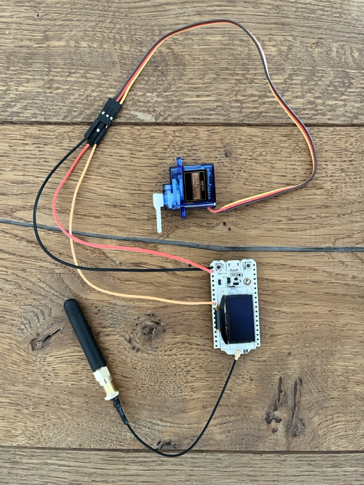
2. It is now recommended to perform a first smoke test: Connect a servo motor to the wires, [install the Cipherlock firmware on the microcontroller](#deploying-to-the-first-lockbox-controller) and trigger an _unlock_ by sending a "correct" `/checkAnswer` request to the game server.
3. Mount the servo motor to the front panel using two M3x16 screws and corresponding nuts. Rotate the servo to its rightmost position, and attach the lever arm pointing to the right as shown below, to allow for a full 180° rotation. 
   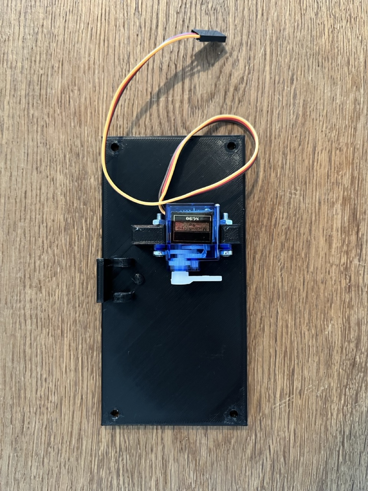
4. Apply a small amount of hot glue to mount an 8x2mm magnet in each of the sockets on the lid.
   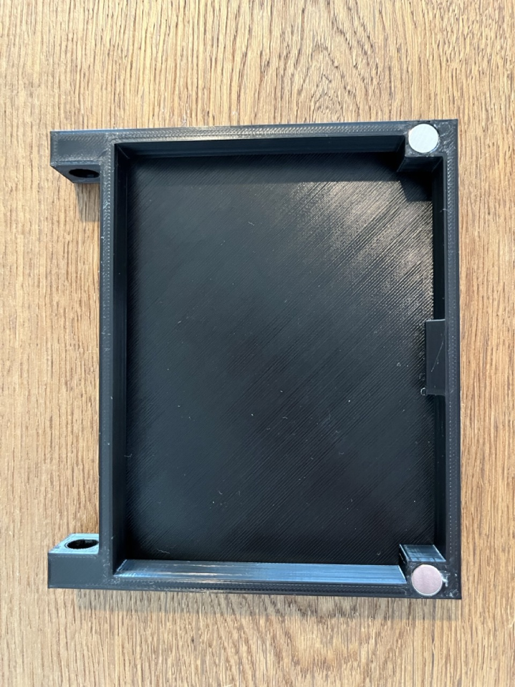
5. Use a small amount of hot glue to mount an 8x2mm magnet in each of the sockets on the base. **These magnets must have opposite polarity to those on the lid, so they repel each other.** Then, use a soldering iron to sink an M3 hex nut into each six front-facing sockets on the base (four on the front column and two on the rear panel). **Note:** All nut sockets are intentionally cut smaller than the outer diameter of the hex nut.
   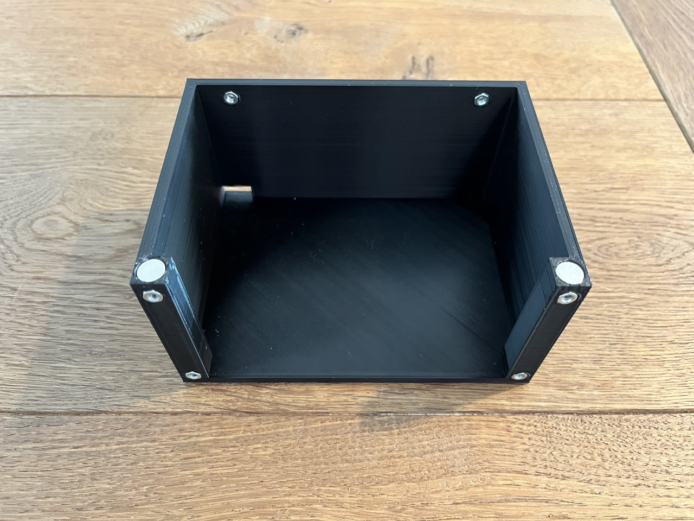
   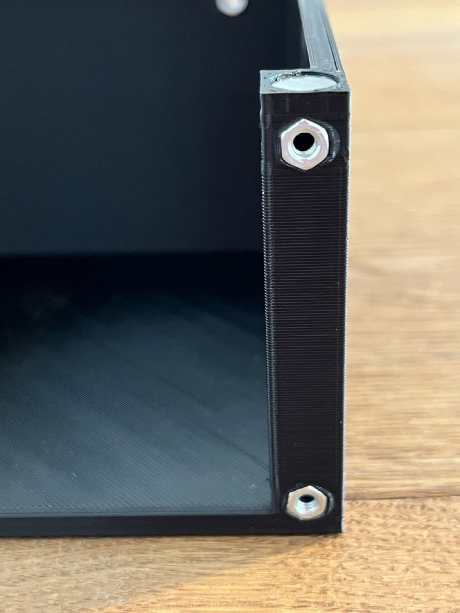
   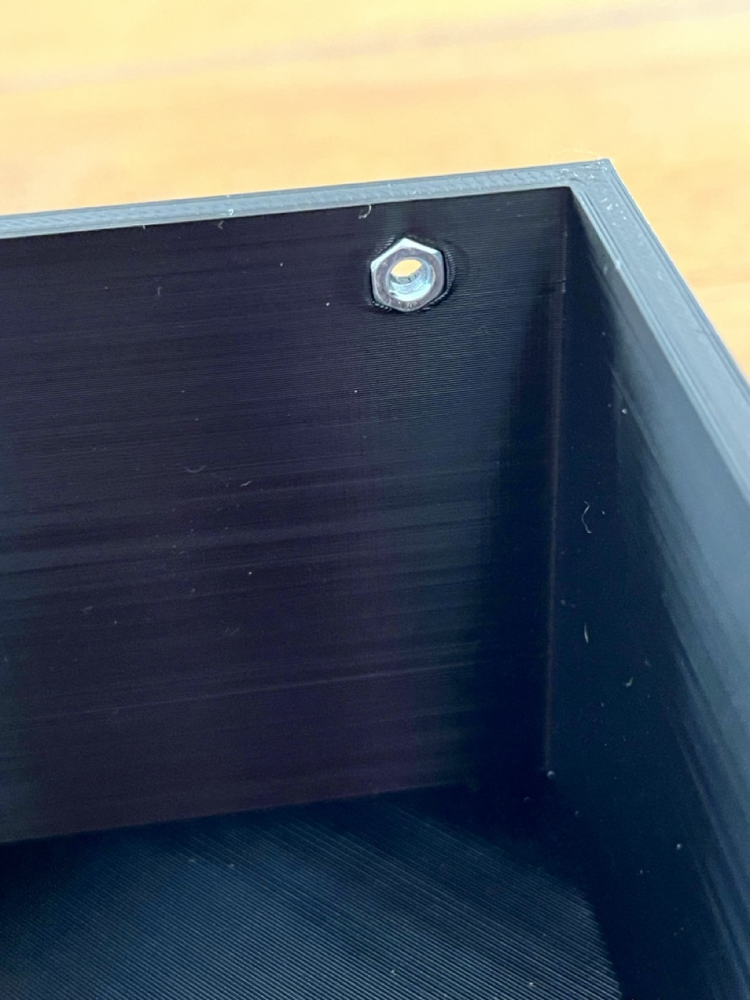
6. Assemble the base, lid and latches as shown below, using two M3x16 screws. Due to the magnets, the lid should now come to rest at a slight angle.
   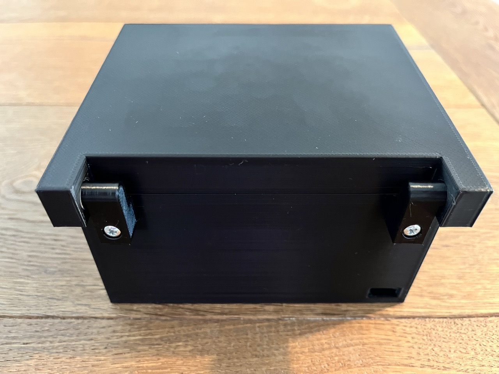
   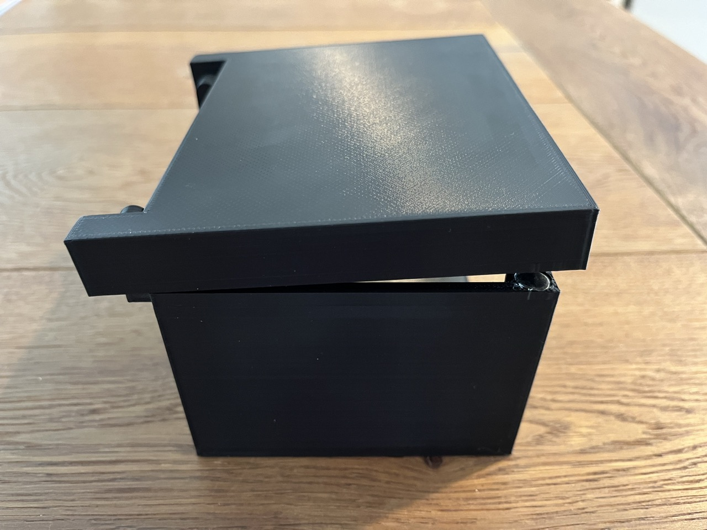
7. Use a soldering iron to sink an M3 nut into the corresponding socket on the hinge. **Careful:** The two sides of the hinge have different cutouts. Be sure to use the side facing the servo during this step. 
   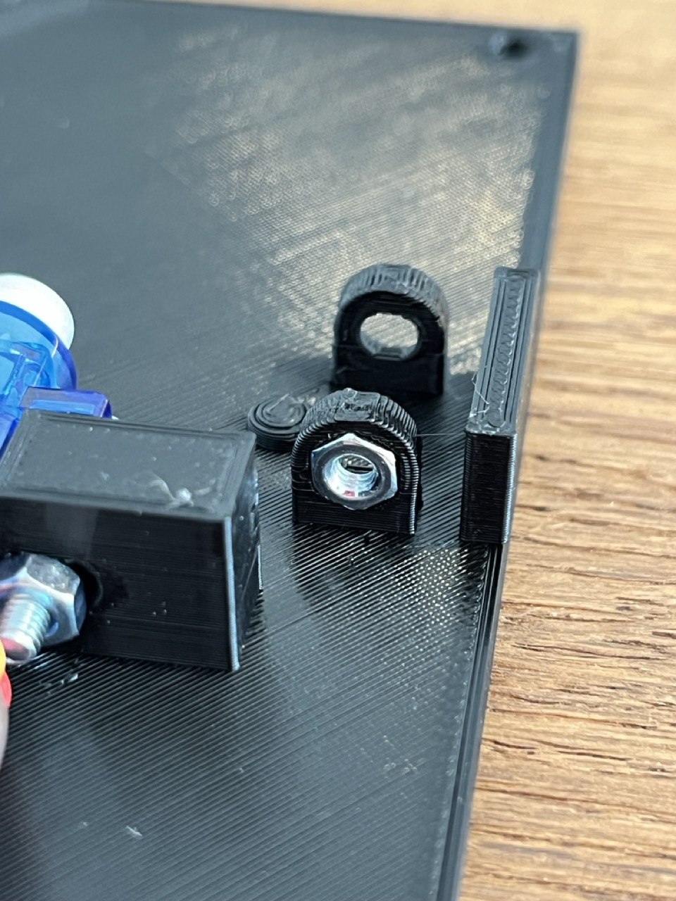
8. Fasten the latch to the front panel as shown below using an M3x16 screw and a 6.5x10mm compression spring.
   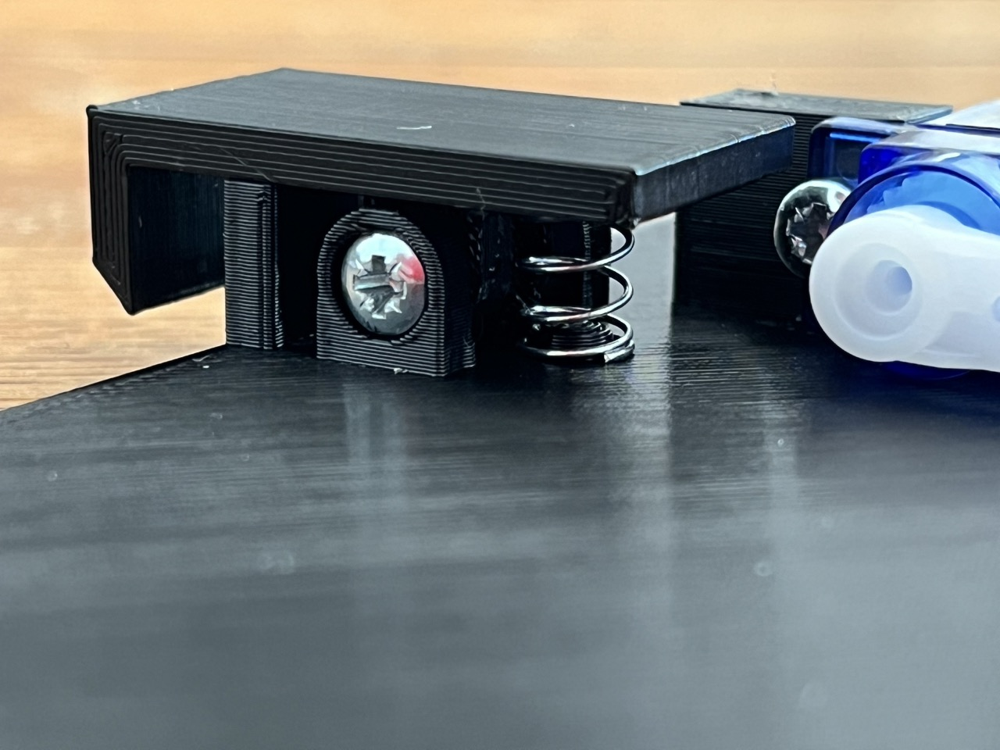
9. Connect the servo and a USB cable to the ESP32 microcontroller and place the assembly into the box. Use the cutout at the rear of the base to route the USB cable into the box. At this point, you should ideally perform another smoke test before proceeding to the next step.
   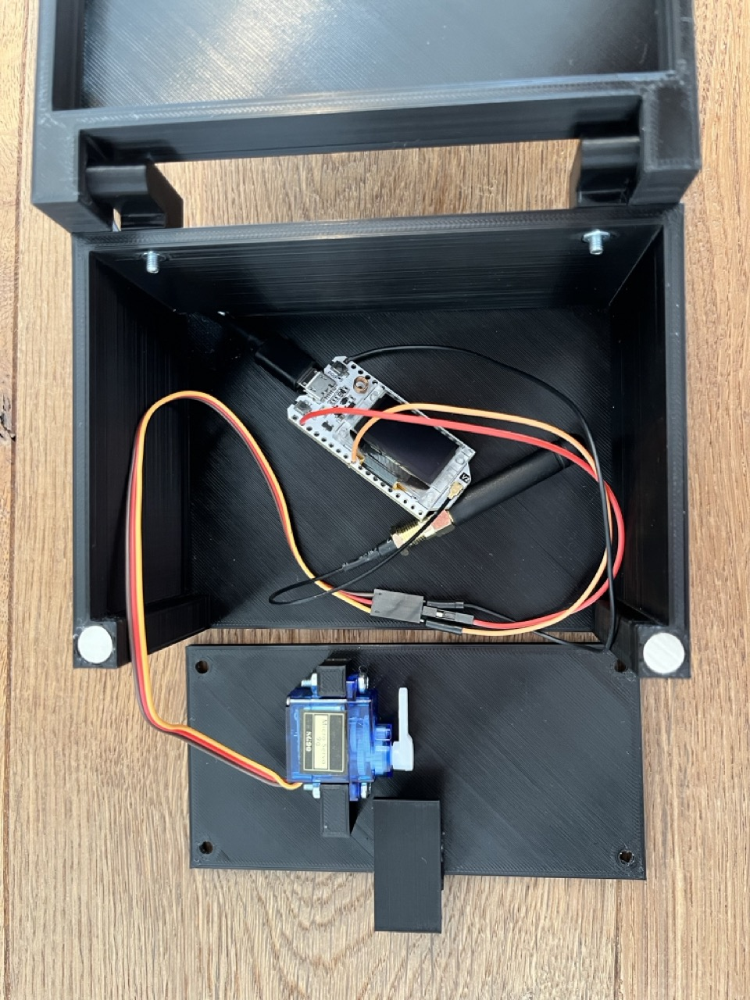
10. Lower the cover into the base, ensuring no pressure is applied to any components or solder joints. Before proceeding to the next step, rotate the servo motor to the left until it touches the latch (not shown in the image).
    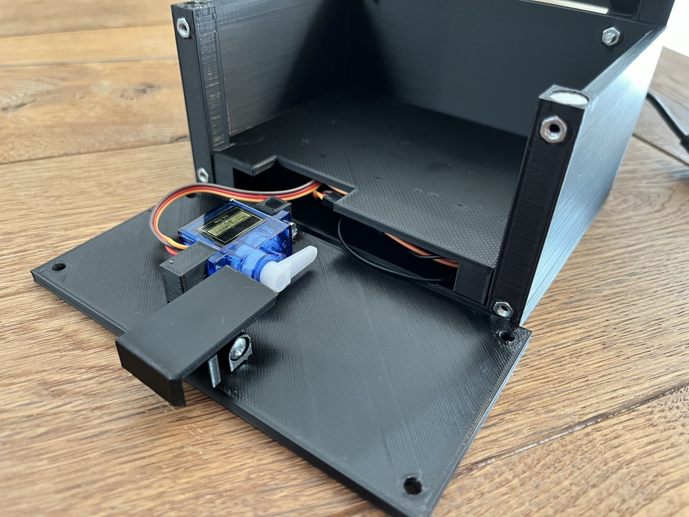
11. For the final step, fasten the front panel to the base using four M3x10 screws.
    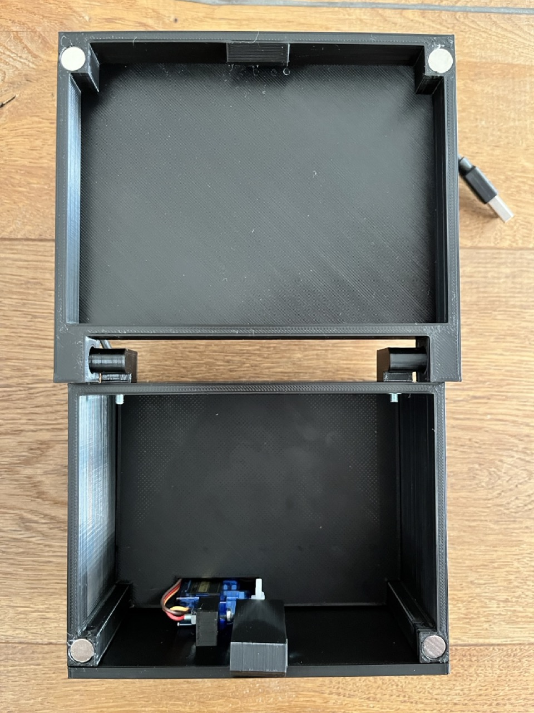

The box is now fully assembled. To complete the setup, the following next steps are recommended in this order:
1. If not done already, [deploy the lockbox controller firmware to the ESP32 device](#deploying-to-the-first-lockbox-controller).
2. Perform a smoke test by triggering an _unlock_ via a "correct" `/checkAnswer` request to the game server. The latch should now retract and quickly be released back into its neutral position. **If the latch does not get released (i.e. the servo does not return to idle), immediately disconnect the USB cable to avoid damage.** Change the `IDLE_ANGLE` and `UNLOCK_ANGLE` properties in `config.py` accordingly (see `config.example.py` for further information).
3. Close the lid check whether the box properly locks.
4. Perform another _unlock_ and verify that the box opens as expected.